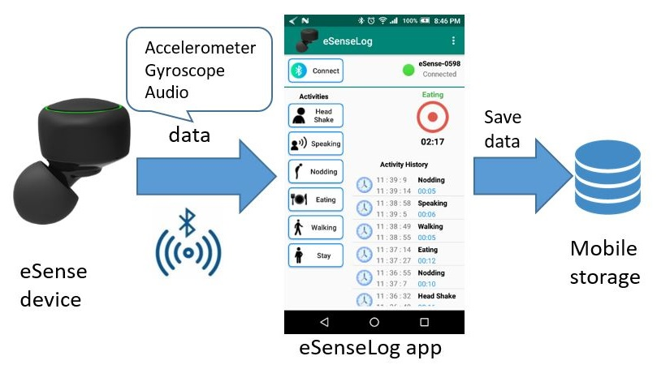
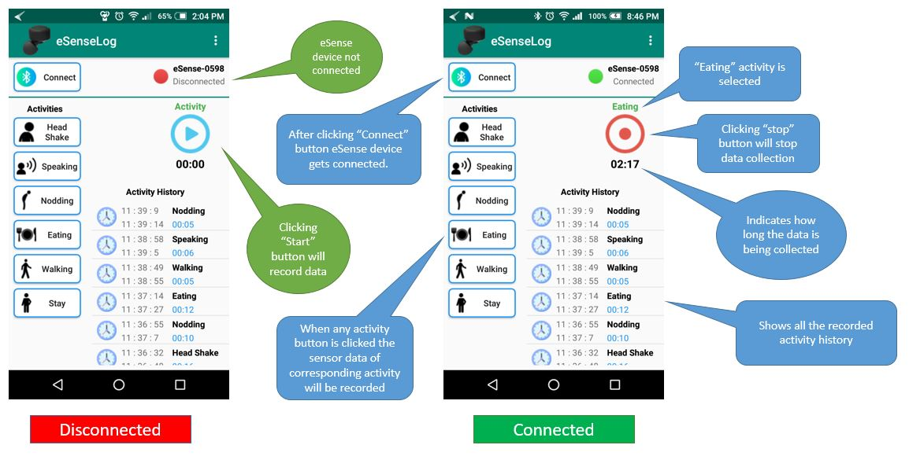
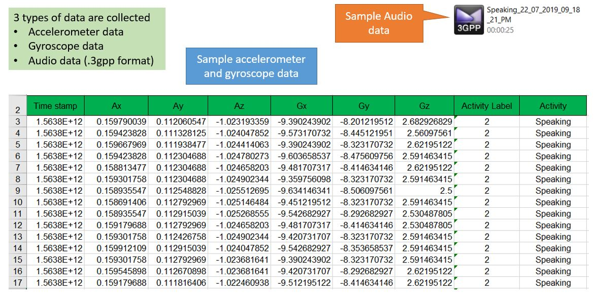

# Esense

This is an Android application. The app establishes connection with a Bluetooth Low Energy (BLE) earble device named [eSense](http://www.esense.io/). The device is developed by NOKIA Bell Labs Cambridge.  

 The device contains sensor which provides accelerometer and gyroscope data. From this data hand and mouth related activities like eating, swallowing, speaking, head shaking etc. can be recognized by machine learning algorithms like CNN, LSTM.

# IDE

- **Android Studio**

# Architecture
- The eSense device gets connected with mobile via Bluetooth. Once the connection gets established, the sensor data is recorded.

# Application Overview
- Clicking the **Connect** button user connects eSense device with mobile
- After selecting any **activity** , if user click **Start** icon the data will start to be recorded
- Clikcing the **Stop** icon will save the recorded data in mobile
- User can also see the recorded activity history

# Data Collection
From the earable device 3 types of data can be collected.
  - **Audio**
  - **Accelerometer**
  - **Gyroscope**

The accelerometer and gyroscope data is saved in mobile storage as **.csv** format. On the other hand audio data is saved as **.3gpp** format in mobile storage.

